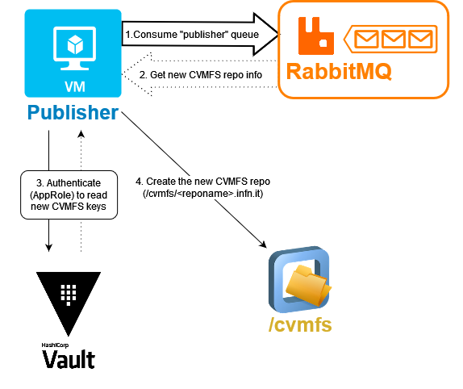
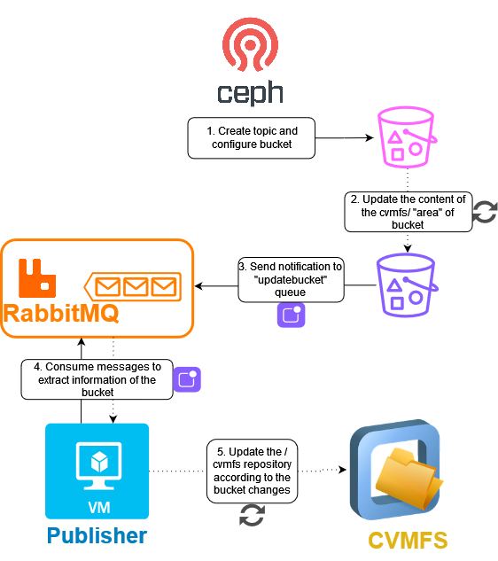

# CVMFS publisher - RabbitMQ - Vault interaction

CVMFS publisher is notified when new CVMFS repositories are created to retrieve the repository keys from Vault and make the repository accessible to the publisher via the gateway.
It is implemented using the [publisher_consumer.py](https://baltig.infn.it/infn-cloud/wp6/cvmfs-publisher/-/blob/main/scripts/publisher_consumer.py?ref_type=heads) script. 
It establishes a secure connection with RabbitMQ to digest messages stored in the publisher queue.
The application authenticates to Vault via a read_only AppRole, downloads the keys, creates the CVMFS repositories, connect to RGW and create the topic, connect to RabbitMQ and create the corresponding queue. 

# CVMFS publisher - RabbitMQ - Ceph RGW interaction

The user populates his repository by accessing his own S3 bucket via the web application https://s3webui.cloud.infn.it/ (or using the standard CVMFS mechanisms by a CVMFS publisher) and upload the software he wants to distribute in the cvmfs bucket. 

As soon as the user uploads software to the bucket, the system is notified and start synchronizing the contents of the bucket with the corresponding CVMFS repository.

CVMFS publisher gets notified by RabbitMQ when the content of the cvmfs/ area of the S3 buckets changes running the [cvmfs_repo_consumers.py](https://baltig.infn.it/infn-cloud/wp6/cvmfs-publisher/-/blob/main/scripts/cvmfs_repo_consumers.py?ref_type=heads) script, and starts the synchronization of the content of the /data/cvmfs/<reponame> folders with the corresponding CVMFS repositories with the [cvmfs_repo_sync.py](https://baltig.infn.it/infn-cloud/wp6/cvmfs-publisher/-/blob/main/scripts/cvmfs_repo_sync.py?ref_type=heads) script 

# Documentations

[User guide](https://confluence.infn.it/display/INFNCLOUD/Software+Management+user+guide)

[CVMFS Service Card](https://confluence.infn.it/display/INFNCLOUD/CVMFS+Service+Card)